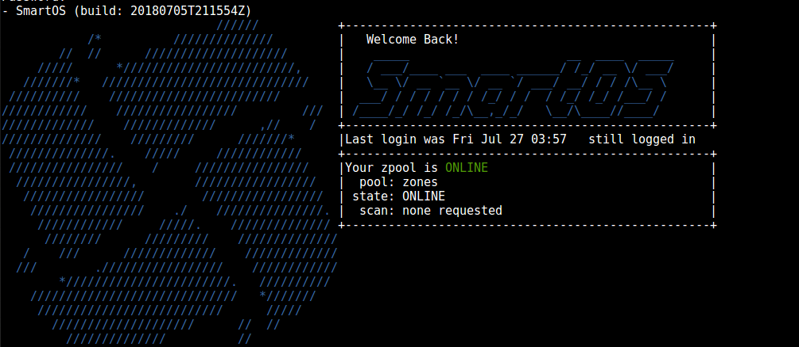

# Global Comfort Zone

##### _Enjoy Your Feeling_ ( ͡° ͜ʖ ͡°)
A set of modifications to improve the comfort of the Global Zone as a workspace

Currently this repo is under testing: please use at your own risk.

## Installation

1. Copy the contents of the git repo into /opt

2. Delete (or merge the contents of) any `.bashrc`, `.bash_profile`, etcetera you might have in /root/

3. Create any additional dotfiles you would like to use such as `.bash_history`, `.vim` or `.ssh` in `/opt/custom/root`

3.5. Optional: also install https://github.com/elzr/vim-json into `/opt/custom/root/.vim`

4. Symlink the new dotfiles into the root directory with `ln -nsf /opt/custom/root/.[a-zA-Z0-9]* /root/'`

All done! Any changes to the dot files will be saved in /opt and will be automatically symlinked back into your home directory at boot.
